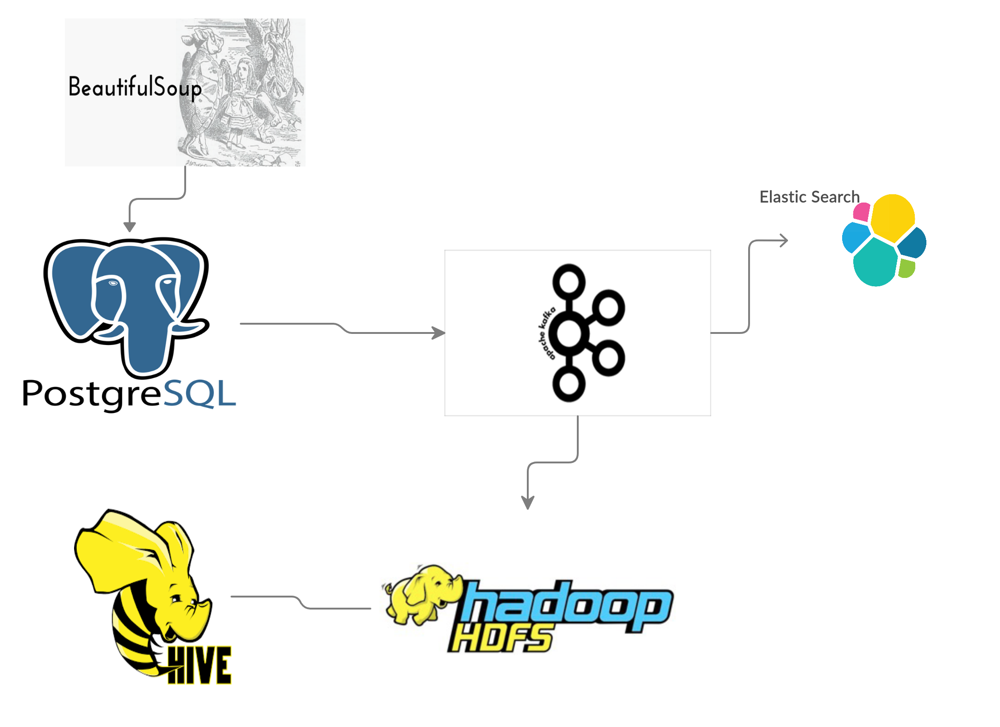

# Snotel data pipeline
This repository contains a data pipeline as well as a front end (Angular) as well as a backend (Django REST) to query and
plot the data.  

This pipeline scrapes data streamflow from the USDA as well as trip reports from the WTA (Washginton Trails Assosication) and uses 
    - Use psycopg2 to insert data into a postgresDB
    - Using Kafka Connect & the Debezium postgres connector the trip reports are put into a Kafka topic and then streamed into 
    Elastic Search using Confluent's ElasticSearch sink
    - Currently using JSON serialization but next step is to use AVRO

